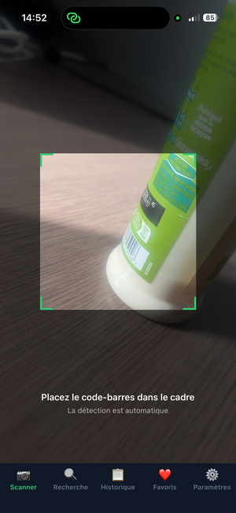
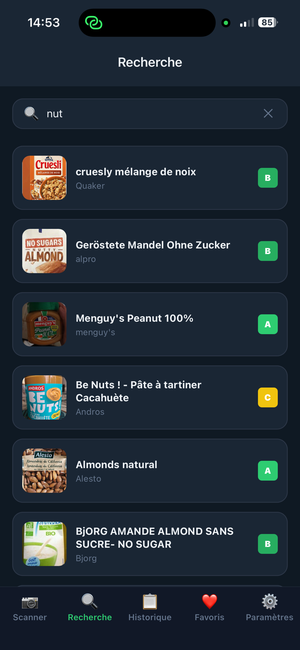
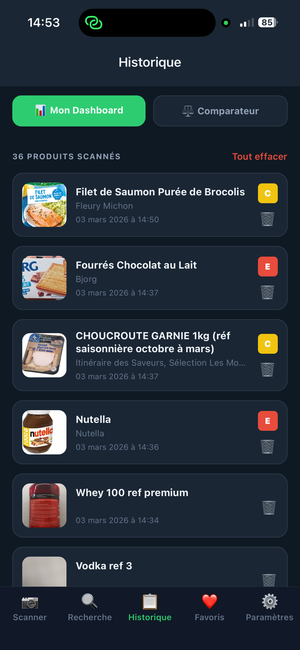
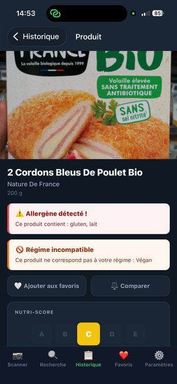
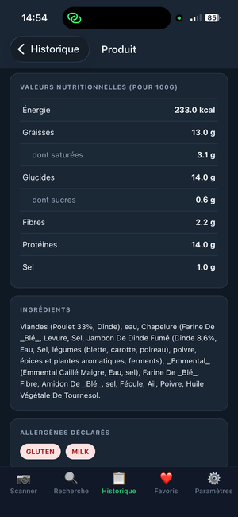
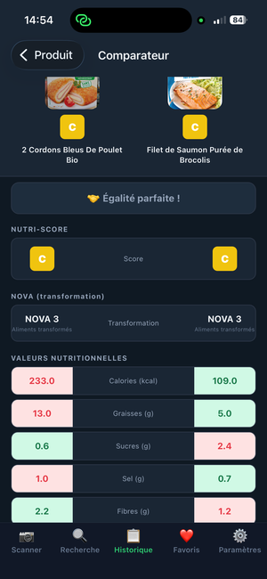
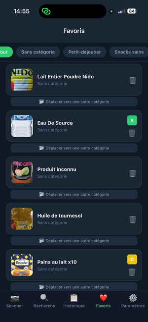
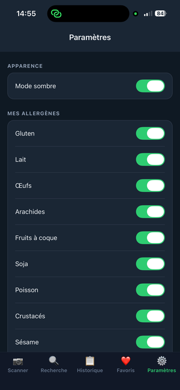
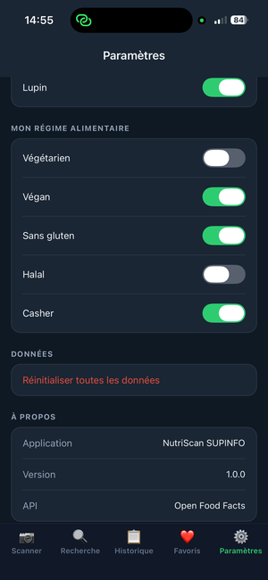

# NutriScan SUPINFO

> **Scannez. Comprenez. Mangez mieux.**

Application mobile de scan alimentaire développée dans le cadre du module React Native — Bac+3 SUPINFO.  
NutriScan permet de scanner le code-barres d'un produit alimentaire pour obtenir instantanément ses informations nutritionnelles, son score de qualité et des alertes personnalisées selon vos préférences alimentaires.

---

## Captures d'écran

<p align="center">
  
  
  
</p>

<p align="center">
  
  
  
</p>

<p align="center">
  
  
  
</p>

---

## Installation et lancement

```bash
# Cloner le repository
git clone https://github.com/goyogoy/3ANDM.git
cd 3ANDM

# Installer les dépendances
npm install --legacy-peer-deps

# Lancer l'application
npx expo start
```

Scanner le QR code avec **Expo Go** sur iOS ou Android.

---

## Fonctionnalités implémentées

### Fonctionnalités obligatoires
- **Scanner de code-barres** — détection automatique EAN-13, UPC-A, UPC-E avec overlay visuel, indicateur de chargement et gestion des erreurs
- **Fiche produit complète** — photo, nom, marque, quantité, Nutri-Score visuel (A→E), groupe NOVA avec signification, tableau nutritionnel pour 100g (énergie, graisses, glucides, sucres, fibres, protéines, sel), liste des ingrédients, allergènes mis en évidence
- **Recherche de produits** — barre de recherche avec debounce 450ms, résultats avec image/nom/marque/Nutri-Score, message si aucun résultat
- **Historique des scans** — persistance AsyncStorage entre sessions, ordre chronologique inverse, suppression individuelle ou totale
- **Dark Mode** — activable depuis les paramètres, persisté entre les sessions, appliqué sur tous les écrans
- **Navigation** — Tab Navigator (5 onglets) + Stack Navigator par onglet

### Fonctionnalités différenciantes
- **Comparateur de produits** — deux colonnes côte à côte, code couleur vert/rouge par critère nutritionnel, résumé du gagnant
- **Profil allergènes** — 13 allergènes configurables (gluten, lait, œufs, arachides, fruits à coque, soja, poisson, crustacés, sésame, sulfites, céleri, moutarde, lupin), alertes visuelles sur la fiche produit
- **Régimes alimentaires** — végétarien, végan, sans gluten, halal, casher, alerte si produit incompatible
- **Dashboard personnel** — score nutritionnel moyen, graphique d'évolution semaine par semaine, statistiques (total scans, meilleur et pire score)
- **Favoris avec catégories** — catégories par défaut et personnalisées, déplacement de produits entre catégories, persistance locale

### Bonus implémentés
- **Retour haptique** — feedback lors d'un scan réussi ou d'une erreur

---

## Technologies et librairies

| Technologie | Usage |
|---|---|
| React Native / Expo SDK 54 | Framework mobile |
| TypeScript | Typage statique |
| React Navigation (Tab + Stack) | Navigation multi-écrans |
| AsyncStorage | Persistance locale |
| expo-camera | Scanner de code-barres |
| expo-haptics | Retour haptique |
| Open Food Facts API | Base de données alimentaire |
| lodash.debounce | Debounce de la recherche |

---

## Architecture du projet

```
src/
├── components/       ← Composants réutilisables (ProductCard, NutriScoreBadge, SectionHeader)
├── screens/          ← Un fichier par écran
├── navigation/       ← Configuration Tab + Stack Navigators
├── utils/            ← Appels API Open Food Facts + AsyncStorage helpers
├── context/          ← ThemeContext, PreferencesContext
└── hooks/            ← useProduct (custom hook)
```

---

## Répartition du travail

| Fonctionnalité | Développeur |
|---|---|
| Scanner de code-barres | Sadia |
| Fiche produit complète + alertes allergènes | Sadia |
| Historique des scans | Sadia|
| Dashboard score nutritionnel | Sadia |
| Comparateur de produits | Sadia |
| Favoris avec catégories | Jules & Sadia |
| Navigation (Tab + Stack) | Jules|
| Recherche avec debounce | Jules|
| Paramètres (dark mode, allergènes, régimes) | Jules |
| Contextes React (thème, préférences) | Jules |
| Persistance AsyncStorage | Jules |

---

## API

Données fournies par [Open Food Facts](https://world.openfoodfacts.org/) — base de données alimentaire open source, sans inscription.

- `GET /api/v2/product/{barcode}.json` — fiche produit complète
- `GET /cgi/search.pl?search_terms=…&json=1` — recherche textuelle

Header d'identification inclus dans chaque requête : `NutriScanSUPINFO/1.0`
